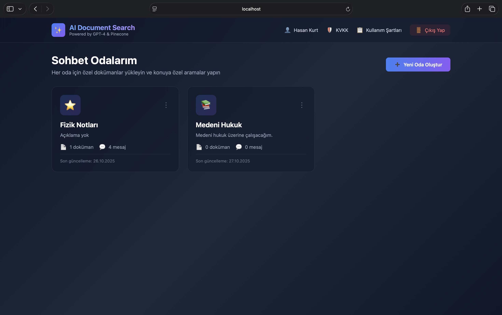
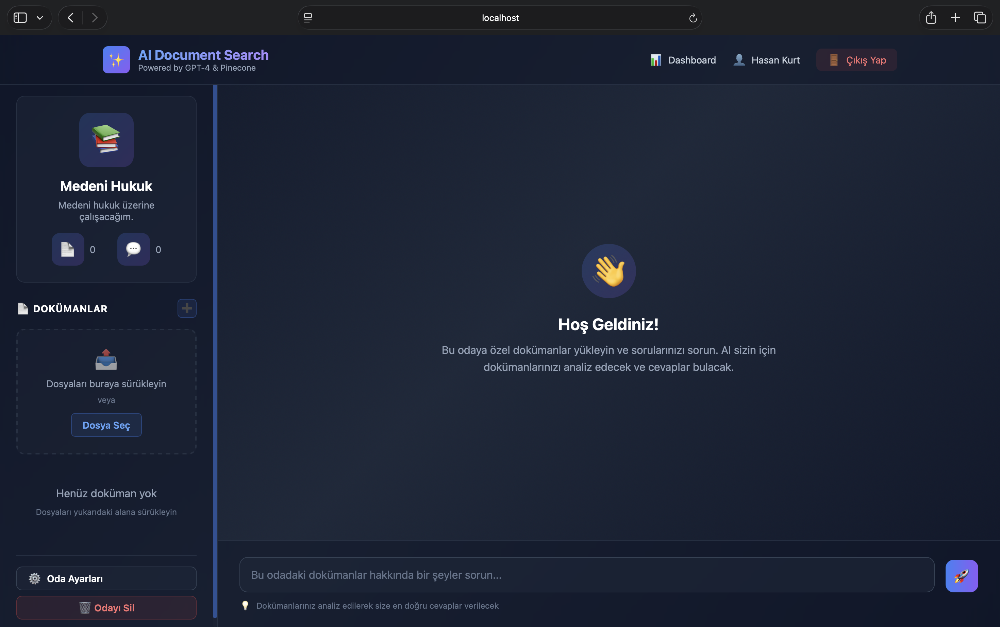
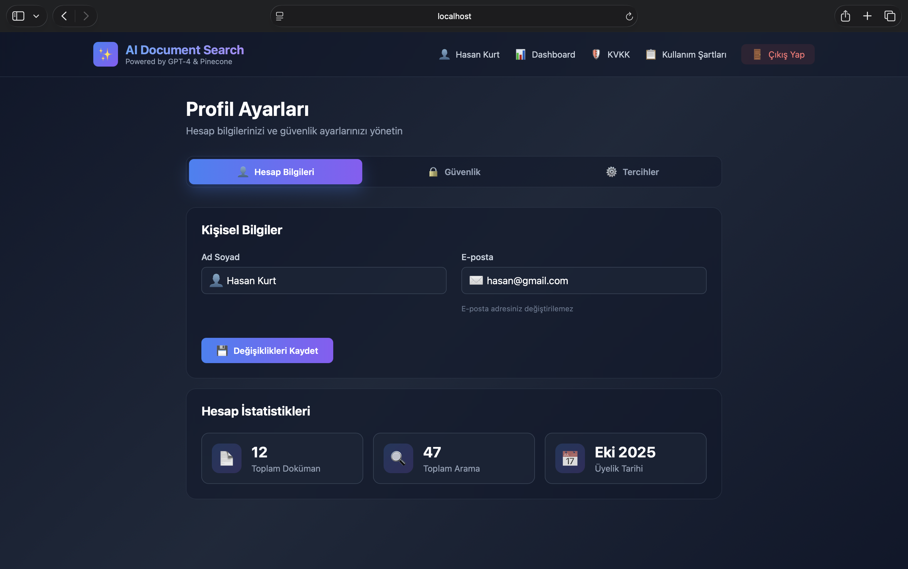

# 🤖 AI Document Search

AI destekli akıllı doküman arama ve soru-cevap sistemi. GPT-4 ve Pinecone teknolojileri ile güçlendirilmiş, kullanıcı dostu bir doküman yönetim platformu.

## ✨ Özellikler

### 🎯 Sohbet Odaları Sistemi
- Her konuya özel ayrı sohbet odaları oluşturma
- Odaya özel doküman yükleme ve yönetimi
- Her oda için bağımsız sohbet geçmişi
- Emoji ile oda kişiselleştirme (240+ emoji)

### 📄 Doküman Yönetimi
- Drag & Drop ile kolay dosya yükleme
- PDF, DOC, DOCX, TXT format desteği
- Doküman bazlı arama ve filtreleme
- Kaynak gösterimi ile şeffaf yanıtlar

### 💬 Akıllı Sohbet
- GPT-4 destekli doğal dil işleme
- Pinecone vektör veritabanı ile hızlı arama
- Kaynak belirtmeli yanıtlar
- Enter ile mesaj gönderme (Shift+Enter: yeni satır)

### 👤 Kullanıcı Yönetimi
- Güvenli giriş/kayıt sistemi
- Profil yönetimi
- Şifre değiştirme
- İki faktörlü kimlik doğrulama (yakında)

### 🎨 Modern Arayüz
- Responsive tasarım (mobil uyumlu)
- Dark mode tema
- Smooth animasyonlar
- Premium emoji seçici

## 🛠️ Teknolojiler

### Frontend
- HTML5, CSS3, JavaScript (Vanilla)
- Modern CSS (Grid, Flexbox, Animations)
- LocalStorage ile state yönetimi

### Backend (Yakında)
- Python Flask/FastAPI
- OpenAI GPT-4 API
- Pinecone Vector Database
- LangChain
- JWT Authentication

## 📦 Kurulum

### Gereksinimler
- Python 3.8+
- Node.js 14+ (opsiyonel)
- OpenAI API Key
- Pinecone API Key

### Adım 1: Projeyi Klonla
```bash
git clone https://github.com/hasankurtt/ai-document-search.git
cd ai-document-search
```

### Adım 2: Virtual Environment Oluştur
```bash
python3 -m venv venv
source venv/bin/activate  # Linux/Mac
# veya
venv\Scripts\activate  # Windows
```

### Adım 3: Bağımlılıkları Yükle
```bash
pip install -r requirements.txt
```

### Adım 4: Environment Variables
```bash
cp .env.example .env
# .env dosyasını düzenle ve API keylerini ekle
```

### Adım 5: Frontend'i Çalıştır
```bash
cd frontend
python3 -m http.server 8000
```

Tarayıcıda `http://localhost:8000` adresine git.

## 📁 Proje Yapısı
```
ai-document-search/
├── frontend/
│   ├── index.html          # Ana sayfa (login redirect)
│   ├── login.html          # Giriş/Kayıt sayfası
│   ├── dashboard.html      # Sohbet odaları
│   ├── room.html           # Oda içi sohbet
│   ├── profile.html        # Kullanıcı profili
│   ├── kvkk.html          # KVKK metni
│   ├── terms.html         # Kullanım şartları
│   ├── css/
│   │   └── style.css      # Tüm stiller
│   └── js/
│       ├── auth.js        # Kimlik doğrulama
│       ├── dashboard.js   # Oda yönetimi
│       ├── room.js        # Sohbet fonksiyonları
│       └── profile.js     # Profil yönetimi
├── backend/               # (Yakında)
│   ├── app.py
│   ├── models/
│   ├── routes/
│   └── utils/
├── venv/                  # Virtual environment
├── .env.example          # Environment variables şablonu
├── .gitignore
├── requirements.txt
└── README.md
```

## 🎮 Kullanım

### 1. Kayıt Ol / Giriş Yap
- Sisteme kayıt ol veya mevcut hesabınla giriş yap
- Google ve GitHub ile giriş desteği (yakında)

### 2. Oda Oluştur
- Dashboard'dan "Yeni Oda Oluştur" butonuna tıkla
- Oda adı, açıklama ve emoji seç
- Kategorilere göre organize et (Eğitim, İş, Bilim, vb.)

### 3. Doküman Yükle
- Oda içinde dosyaları sürükle-bırak
- Veya "+" butonuna tıklayarak seç
- PDF, DOCX, DOC, TXT formatları destekleniyor

### 4. Soru Sor
- Chat alanına sorunu yaz
- Enter tuşu ile gönder (Shift+Enter: yeni satır)
- AI dokümanları analiz edip cevap verir
- Kaynak gösterimi ile referansları gör

## 🔐 Güvenlik

- ✅ KVKK uyumlu veri işleme
- ✅ Şifreli veri saklama
- ✅ JWT tabanlı kimlik doğrulama (backend)
- ✅ XSS ve CSRF koruması
- 🔜 İki faktörlü kimlik doğrulama

## 🚀 Roadmap

### v1.0 (Mevcut - Frontend)
- [x] Modern kullanıcı arayüzü
- [x] Sohbet odaları sistemi
- [x] Profil yönetimi
- [x] Responsive tasarım

### v1.1 (Backend Entegrasyonu)
- [ ] Flask/FastAPI backend
- [ ] OpenAI GPT-4 entegrasyonu
- [ ] Pinecone vektör veritabanı
- [ ] Doküman işleme (PDF, DOCX parse)
- [ ] JWT authentication

### v1.2 (Gelişmiş Özellikler)
- [ ] Gerçek zamanlı sohbet (WebSocket)
- [ ] Doküman önizleme
- [ ] Paylaşılan odalar
- [ ] Export/Import fonksiyonları
- [ ] İleri arama filtreleri

### v2.0 (Yapay Zeka Geliştirmeleri)
- [ ] Çoklu dil desteği
- [ ] Ses ile arama
- [ ] Doküman özetleme
- [ ] Otomatik etiketleme
- [ ] Benzer doküman önerisi

## 📝 Lisans

Bu proje MIT lisansı altında lisanslanmıştır. Detaylar için `LICENSE` dosyasına bakın.

## 👤 Geliştirici

**Your Name**
- GitHub: [@hasankurtt](https://github.com/hasankurtt)

## 🙏 Teşekkürler

- OpenAI GPT-4 API
- Pinecone Vector Database
- LangChain
- Tüm açık kaynak katkıda bulunanlar

## 📸 Ekran Görüntüleri

### Dashboard


### Sohbet Odası


### Profil


---

⭐ Projeyi beğendiyseniz yıldız vermeyi unutmayın!
