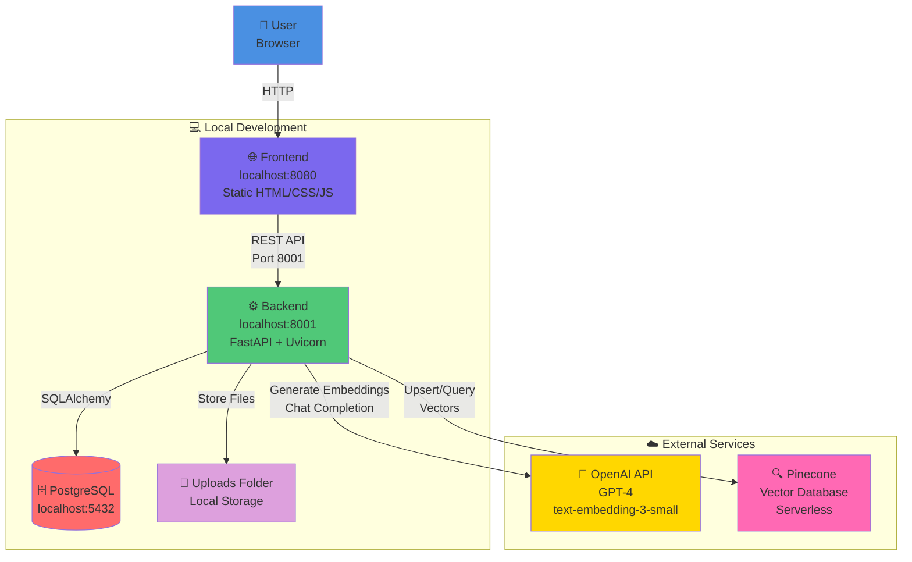
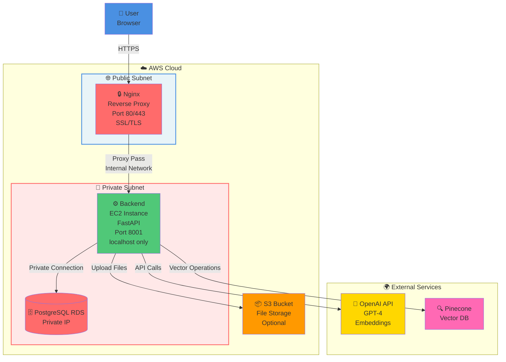
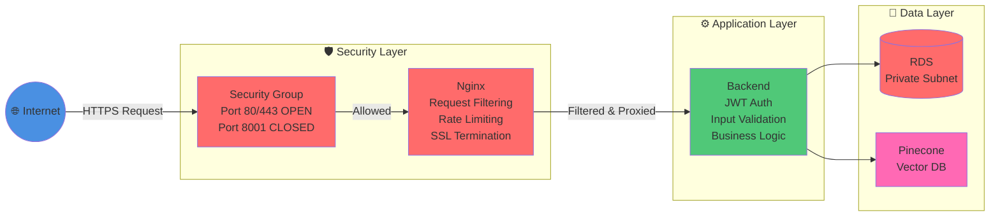
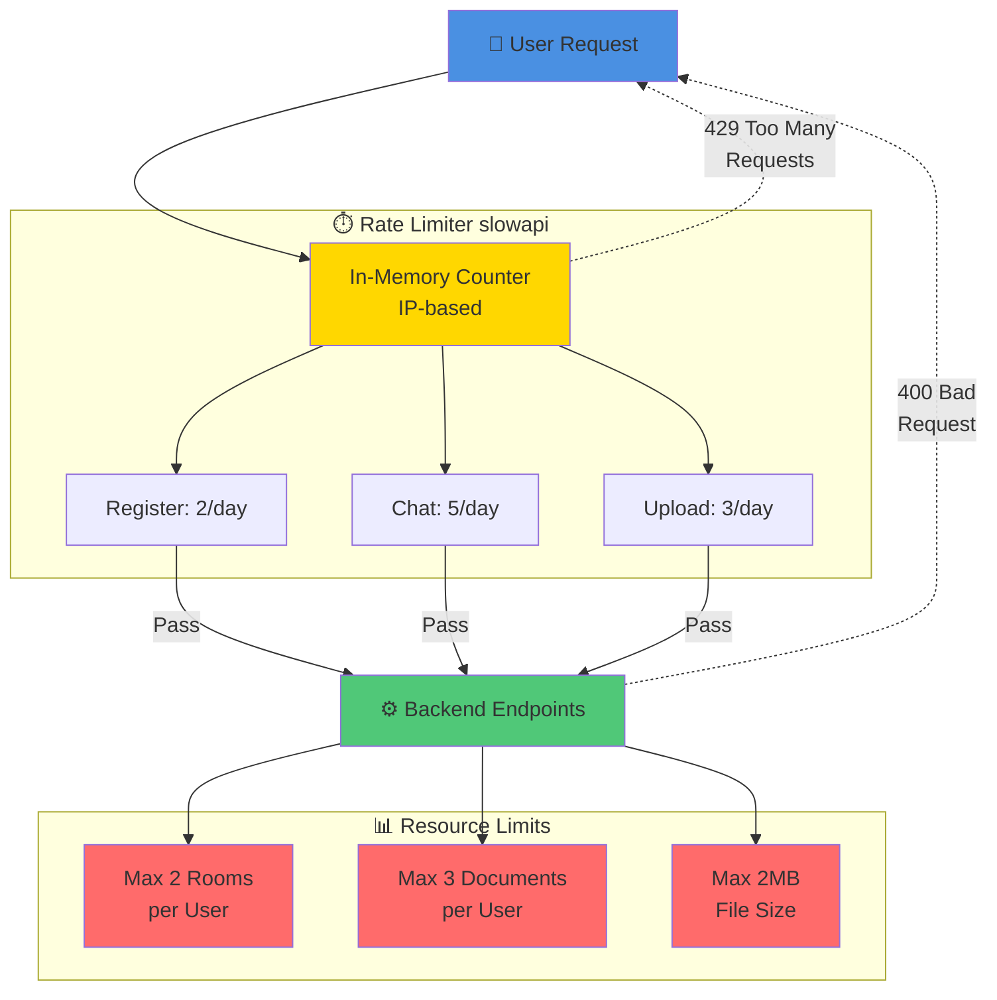
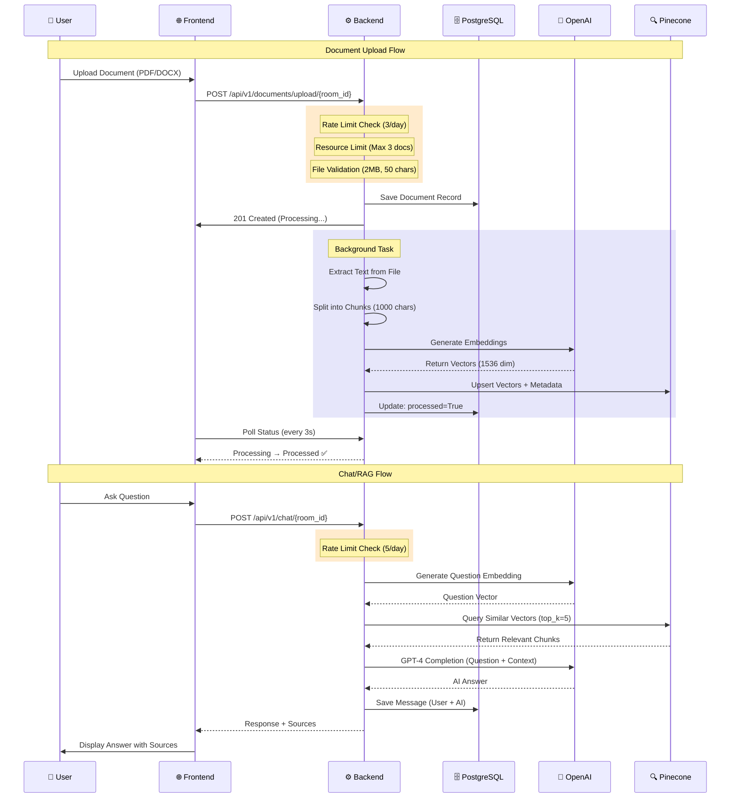
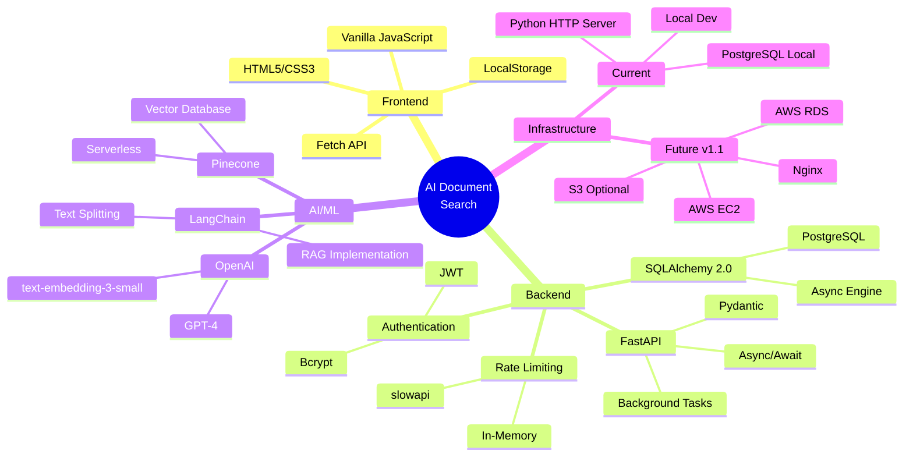

# Architecture Diagrams

## Current Architecture (v1.0 - Local Development)

---

## Future Architecture (v1.1 - AWS Deployment with Nginx)

---

## Key Architecture Differences

### v1.0 (Current - Local)
- ✅ **Frontend**: Served via Python HTTP server (localhost:8080)
- ✅ **Backend**: Directly accessible (localhost:8001)
- ✅ **Database**: Local PostgreSQL
- ✅ **Storage**: Local file system
- ⚠️ **Security**: Development mode, all ports exposed locally

### v1.1 (Future - AWS)
- ✅ **Frontend**: Could be on S3 + CloudFront (or served by Nginx)
- ✅ **Nginx**: Acts as reverse proxy and security gateway
- ✅ **Backend**: Hidden in private subnet, only accessible via Nginx
- ✅ **Database**: Managed RDS in private subnet
- ✅ **Storage**: S3 bucket (scalable, durable)
- ✅ **Security**: 
  - Backend not exposed to internet
  - Single entry point (Port 80/443)
  - SSL/TLS encryption
  - Security groups & network ACLs

---

## Security Flow (v1.1)

---

## Rate Limiting Architecture

---

## Data Flow: Document Upload & RAG

---

## Technology Stack Overview

---

## Notes

- **Mermaid diagrams** render automatically on GitHub
- Save this file as `docs/architecture.md`
- Reference in main README: `[Architecture Diagrams](docs/architecture.md)`
- For PNG/SVG exports, use [Mermaid Live Editor](https://mermaid.live/)
